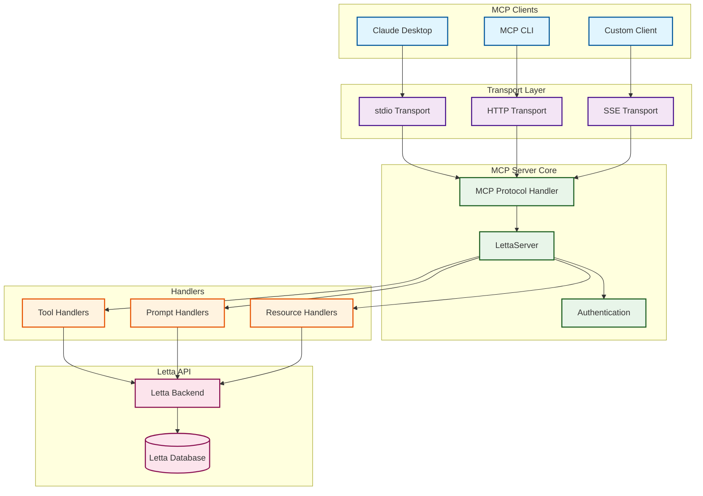
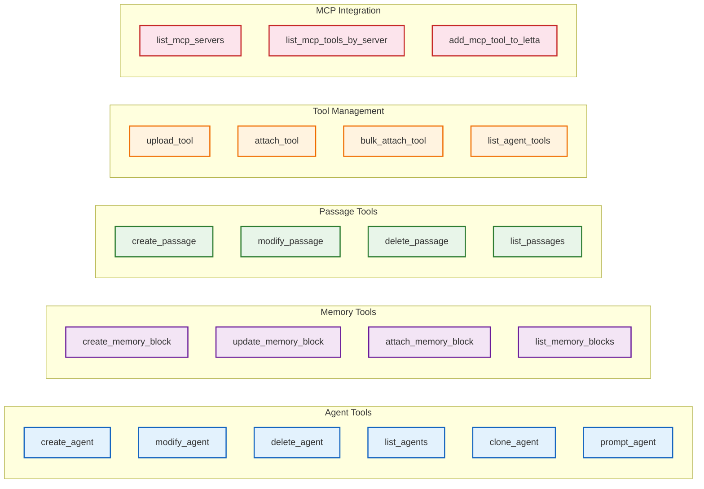
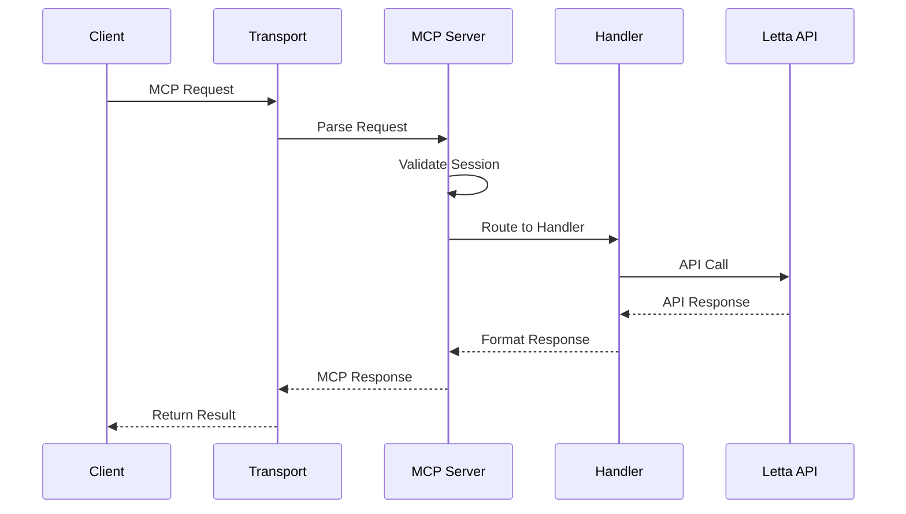
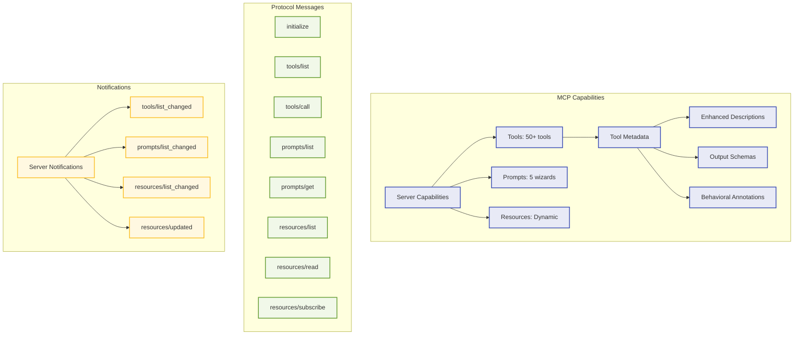
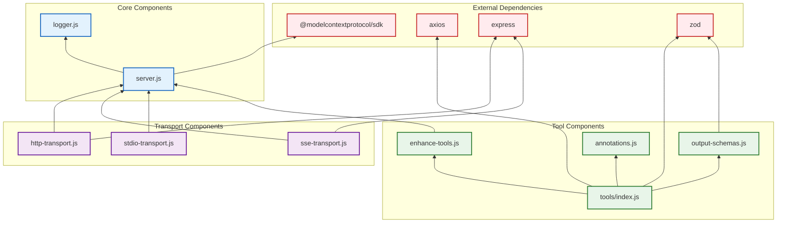
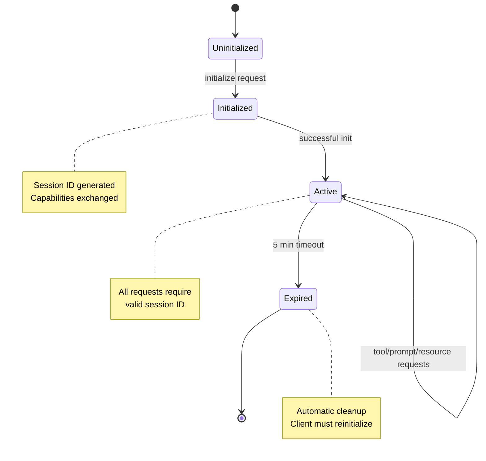

# Letta MCP Server Architecture

## System Overview

```mermaid
graph TB
    subgraph "MCP Clients"
        C1[Claude Desktop]
        C2[MCP CLI]
        C3[Custom Client]
    end

    subgraph "Transport Layer"
        T1[stdio Transport]
        T2[HTTP Transport]
        T3[SSE Transport]
    end

    subgraph "MCP Server Core"
        S[LettaServer]
        MCP[MCP Protocol Handler]
        AUTH[Authentication]
    end

    subgraph "Handlers"
        TH[Tool Handlers]
        PH[Prompt Handlers]
        RH[Resource Handlers]
    end

    subgraph "Letta API"
        LA[Letta Backend]
        DB[(Letta Database)]
    end

    C1 --> T1
    C2 --> T2
    C3 --> T3

    T1 --> MCP
    T2 --> MCP
    T3 --> MCP

    MCP --> S
    S --> AUTH
    S --> TH
    S --> PH
    S --> RH

    TH --> LA
    PH --> LA
    RH --> LA

    LA --> DB

    classDef client fill:#e1f5fe,stroke:#01579b,stroke-width:2px
    classDef transport fill:#f3e5f5,stroke:#4a148c,stroke-width:2px
    classDef server fill:#e8f5e9,stroke:#1b5e20,stroke-width:2px
    classDef handler fill:#fff3e0,stroke:#e65100,stroke-width:2px
    classDef api fill:#fce4ec,stroke:#880e4f,stroke-width:2px

    class C1,C2,C3 client
    class T1,T2,T3 transport
    class S,MCP,AUTH server
    class TH,PH,RH handler
    class LA,DB api
```

## Tool Categories

```mermaid
graph LR
    subgraph "Agent Tools"
        A1[create_agent]
        A2[modify_agent]
        A3[delete_agent]
        A4[list_agents]
        A5[clone_agent]
        A6[prompt_agent]
    end

    subgraph "Memory Tools"
        M1[create_memory_block]
        M2[update_memory_block]
        M3[attach_memory_block]
        M4[list_memory_blocks]
    end

    subgraph "Passage Tools"
        P1[create_passage]
        P2[modify_passage]
        P3[delete_passage]
        P4[list_passages]
    end

    subgraph "Tool Management"
        T1[upload_tool]
        T2[attach_tool]
        T3[bulk_attach_tool]
        T4[list_agent_tools]
    end

    subgraph "MCP Integration"
        MC1[list_mcp_servers]
        MC2[list_mcp_tools_by_server]
        MC3[add_mcp_tool_to_letta]
    end

    classDef agentTool fill:#e3f2fd,stroke:#1565c0,stroke-width:2px
    classDef memoryTool fill:#f3e5f5,stroke:#6a1b9a,stroke-width:2px
    classDef passageTool fill:#e8f5e9,stroke:#2e7d32,stroke-width:2px
    classDef toolMgmt fill:#fff3e0,stroke:#ef6c00,stroke-width:2px
    classDef mcpTool fill:#fce4ec,stroke:#c62828,stroke-width:2px

    class A1,A2,A3,A4,A5,A6 agentTool
    class M1,M2,M3,M4 memoryTool
    class P1,P2,P3,P4 passageTool
    class T1,T2,T3,T4 toolMgmt
    class MC1,MC2,MC3 mcpTool
```

## Request Flow

```mermaid
sequenceDiagram
    participant Client
    participant Transport
    participant MCP Server
    participant Handler
    participant Letta API

    Client->>Transport: MCP Request
    Transport->>MCP Server: Parse Request
    MCP Server->>MCP Server: Validate Session
    MCP Server->>Handler: Route to Handler
    Handler->>Letta API: API Call
    Letta API-->>Handler: API Response
    Handler-->>MCP Server: Format Response
    MCP Server-->>Transport: MCP Response
    Transport-->>Client: Return Result
```

## MCP Protocol Implementation

```mermaid
graph TD
    subgraph "MCP Capabilities"
        CAP[Server Capabilities]
        CAP --> TOOLS[Tools: 50+ tools]
        CAP --> PROMPTS[Prompts: 5 wizards]
        CAP --> RESOURCES[Resources: Dynamic]
        
        TOOLS --> TOOL_META[Tool Metadata]
        TOOL_META --> DESC[Enhanced Descriptions]
        TOOL_META --> SCHEMA[Output Schemas]
        TOOL_META --> ANNO[Behavioral Annotations]
    end

    subgraph "Protocol Messages"
        INIT[initialize]
        LIST_TOOLS[tools/list]
        CALL_TOOL[tools/call]
        LIST_PROMPTS[prompts/list]
        GET_PROMPT[prompts/get]
        LIST_RES[resources/list]
        READ_RES[resources/read]
        SUB_RES[resources/subscribe]
    end

    subgraph "Notifications"
        NOTIFY[Server Notifications]
        NOTIFY --> TOOLS_CHANGED[tools/list_changed]
        NOTIFY --> PROMPTS_CHANGED[prompts/list_changed]
        NOTIFY --> RES_CHANGED[resources/list_changed]
        NOTIFY --> RES_UPDATED[resources/updated]
    end

    classDef capability fill:#e8eaf6,stroke:#3f51b5,stroke-width:2px
    classDef message fill:#f1f8e9,stroke:#689f38,stroke-width:2px
    classDef notification fill:#fff8e1,stroke:#fbc02d,stroke-width:2px

    class CAP,TOOLS,PROMPTS,RESOURCES,TOOL_META,DESC,SCHEMA,ANNO capability
    class INIT,LIST_TOOLS,CALL_TOOL,LIST_PROMPTS,GET_PROMPT,LIST_RES,READ_RES,SUB_RES message
    class NOTIFY,TOOLS_CHANGED,PROMPTS_CHANGED,RES_CHANGED,RES_UPDATED notification
```

## Component Dependencies

```mermaid
graph BT
    subgraph "External Dependencies"
        MCP_SDK["@modelcontextprotocol/sdk"]
        AXIOS[axios]
        EXPRESS[express]
        ZOD[zod]
    end

    subgraph "Core Components"
        SERVER[server.js]
        LOGGER[logger.js]
    end

    subgraph "Transport Components"
        HTTP[http-transport.js]
        SSE[sse-transport.js]
        STDIO[stdio-transport.js]
    end

    subgraph "Tool Components"
        TOOLS[tools/index.js]
        ENHANCE[enhance-tools.js]
        SCHEMAS[output-schemas.js]
        ANNOTATIONS[annotations.js]
    end

    SERVER --> MCP_SDK
    SERVER --> LOGGER
    
    HTTP --> EXPRESS
    HTTP --> SERVER
    SSE --> EXPRESS
    SSE --> SERVER
    STDIO --> SERVER
    
    TOOLS --> AXIOS
    TOOLS --> ZOD
    TOOLS --> ENHANCE
    TOOLS --> SCHEMAS
    TOOLS --> ANNOTATIONS
    
    ENHANCE --> SERVER
    SCHEMAS --> ZOD

    classDef external fill:#ffebee,stroke:#c62828,stroke-width:2px
    classDef core fill:#e3f2fd,stroke:#1565c0,stroke-width:2px
    classDef transport fill:#f3e5f5,stroke:#6a1b9a,stroke-width:2px
    classDef tool fill:#e8f5e9,stroke:#2e7d32,stroke-width:2px

    class MCP_SDK,AXIOS,EXPRESS,ZOD external
    class SERVER,LOGGER core
    class HTTP,SSE,STDIO transport
    class TOOLS,ENHANCE,SCHEMAS,ANNOTATIONS tool
```

## Session Management (HTTP Transport)

```mermaid
stateDiagram-v2
    [*] --> Uninitialized
    Uninitialized --> Initialized: initialize request
    Initialized --> Active: successful init
    Active --> Active: tool/prompt/resource requests
    Active --> Expired: 5 min timeout
    Expired --> [*]
    
    note right of Initialized
        Session ID generated
        Capabilities exchanged
    end note
    
    note right of Active
        All requests require
        valid session ID
    end note
    
    note right of Expired
        Automatic cleanup
        Client must reinitialize
    end note
```